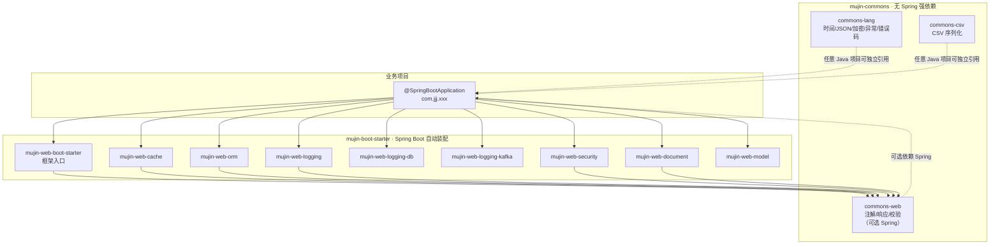
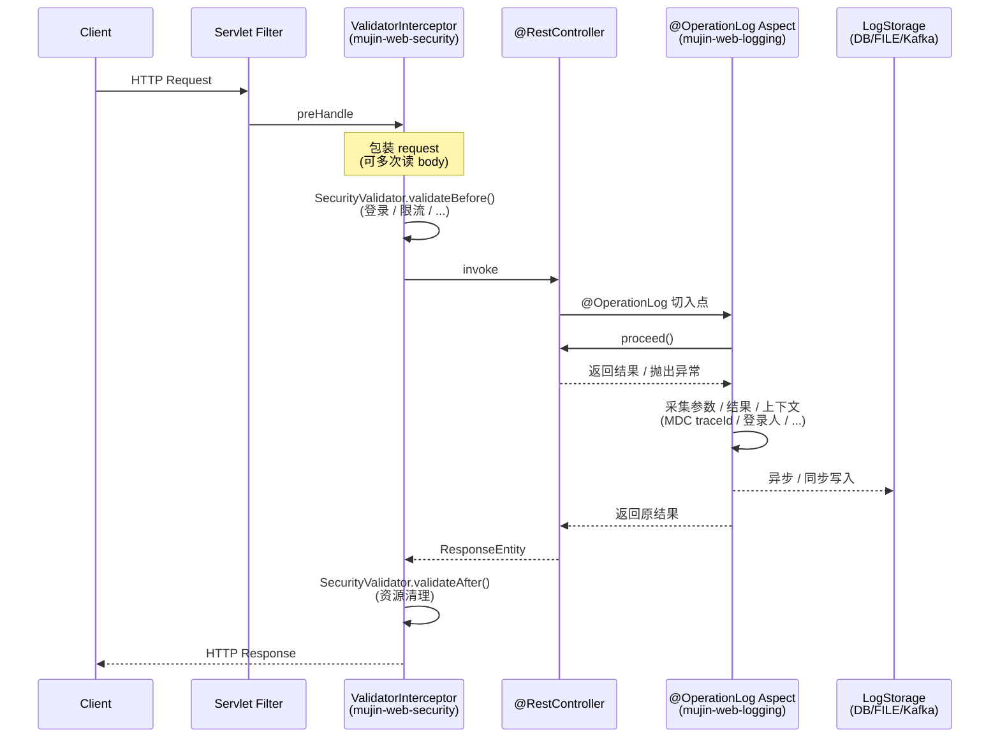

# mujin-framework 架构设计

> 描述 mujin-framework 的模块依赖、请求处理流程与扩展点。

## 1. 模块依赖图



**关键点**：
- `commons-*` 不依赖 Spring，可被任意 Java 项目（甚至非 Spring Boot 应用）独立引用。
- `boot-starter/*` 全部依赖 Spring Boot 3.5.x + JDK 21。
- 业务项目**按需引入** starter 模块，不需要的不引入依赖即可。

## 2. 插件化策略

```mermaid
flowchart LR
    subgraph default[默认行为]
        D1[mujin-web-boot-starter<br/>✅ 默认启用]
        D2[mujin-web-model<br/>✅ 默认启用]
    end

    subgraph optin[按需启用]
        O1[mujin-web-document<br/>❌ → mujin.document.enabled=true]
        O2[mujin-web-logging<br/>❌ → mujin.logging.enabled=true]
        O3[mujin-web-cache<br/>❌ → mujin.cache.enabled=true]
        O4[mujin-web-orm<br/>❌ → mujin.orm.enabled=true]
        O5[mujin-web-security<br/>❌ → mujin.web.config.request.security.validator-enable=true]
    end

    BizApp[业务项目<br/>application.yml] -->|mujin.xxx.enabled=true| optin
    BizApp --> default
```

**核心原则**：引入 starter 依赖 ≠ 启用功能。所有可选模块均通过 `@ConditionalOnProperty(..., matchIfMissing = false)` 控制，业务方必须**显式启用**才能装配对应 Bean。

| 模块 | 启用属性 | 默认 |
| --- | --- | --- |
| `mujin-web-boot-starter` | （无开关） | ✅ 启用 |
| `mujin-web-model` | （无开关） | ✅ 启用 |
| `mujin-web-document` | `mujin.document.enabled=true` | ❌ 关闭 |
| `mujin-web-logging` | `mujin.logging.enabled=true` | ❌ 关闭 |
| `mujin-web-cache` | `mujin.cache.enabled=true` | ❌ 关闭 |
| `mujin-web-orm` | `mujin.orm.enabled=true` | ❌ 关闭 |
| `mujin-web-security` | `mujin.web.config.request.security.validator-enable=true` | ❌ 关闭 |

## 3. 请求处理时序（security + logging）



## 4. 接口文档生成流程（mujin-web-document）

```mermaid
flowchart LR
    SpringContext[Spring 应用上下文] -->|启动时扫描| Springdoc[springdoc-openapi 2.7<br/>自动扫描 @RestController]
    Springdoc -->|生成| OpenAPIBean[OpenAPI Bean<br/>(合并的 OpenAPI 规范)]

    subgraph MWD[mujin-web-document]
        AutoConfig[DocumentAutoConfiguration]
        Parser[OpenApiParserService]
        Controller[DocumentController<br/>/api-docs/*]
        PdfSvc[PdfBoxPdfExportService]
        Examples[CodeExampleGenerator]
    end

    OpenAPIBean -->|注入| Parser
    Springdoc -.->|暴露| V3Api[/v3/api-docs/]
    V3Api -.->|扫描整个应用| BizController[com.jjj.xxx.UserController]

    AutoConfig --> Parser
    AutoConfig --> Controller
    AutoConfig --> PdfSvc
    AutoConfig --> Examples

    Controller -->|/api-docs/export/pdf| PdfSvc
    Controller -->|/api-docs/export/json| Parser
    Controller -->|/api-docs/export/yaml| Parser
    Controller -->|/api-docs/groups| Parser
    Parser -->|解析| ApiDoc[ApiDocument 模型]
    ApiDoc --> PdfSvc
    ApiDoc --> Examples

    PdfSvc -->|Apache PDFBox 3.x| PdfBytes[PDF 字节流]
```

**关键点**：
- `mujin-web-document` **不重新扫描 Controller**——完全复用 springdoc 生成的 `OpenAPI` Bean。
- springdoc 2.7 默认扫描整个 Spring 应用上下文，第三方包（`com.jjj.xxx`）的 Controller **自动被识别**。
- 仅当业务方在 `application.yml` 显式配置 `mujin.document.groups[]` 时，框架才注册 `GroupedOpenApi` Bean 进行分组过滤。

## 5. 操作日志扩展点

```mermaid
flowchart TB
    Aspect[OperationLogAspect]
    Aspect -->|采集参数| Coll[OperationLogCollector 链<br/>(按 order 排序)]
    Coll --> SpEL[SpelParamCollector]
    Coll --> Param[ParamCollector<br/>@LogMask / @LogIgnore]
    Coll --> Web[WebContextCollector]
    Coll --> Login[LoginUserCollector]
    Coll --> Custom[业务自定义 Collector]

    Aspect -->|写入| Storage{LogStorage 选择}
    Storage -->|storage-type=FILE| File[FileLogStorage]
    Storage -->|storage-type=DB| Db[DB Storage<br/>自动建表]
    Storage -->|storage-type=KAFKA| Kafka[Kafka Storage]
```

## 6. 缓存架构

```mermaid
flowchart TB
    Enable[@EnableCacheCustomizer<br/>basePackages + cacheType]
    Enable -->|扫描| Custom[业务 CacheManagerCacheNameCaching 实现]
    Enable --> Redis[RedisCacheManager]
    Enable --> Simple[SimpleCacheManager<br/>本地 ExpiringMap]
    Enable --> Mix[MixCacheManager<br/>两级缓存]

    Custom --> Redis
    Custom --> Simple
    Custom --> Mix
```

业务通过实现 `RedisCacheManagerPrefixCaching` 接口自定义每个 `cacheName` 的 TTL / KeyPrefix / Serializer，由 `@EnableCacheCustomizer` 在启动时扫描注入。
